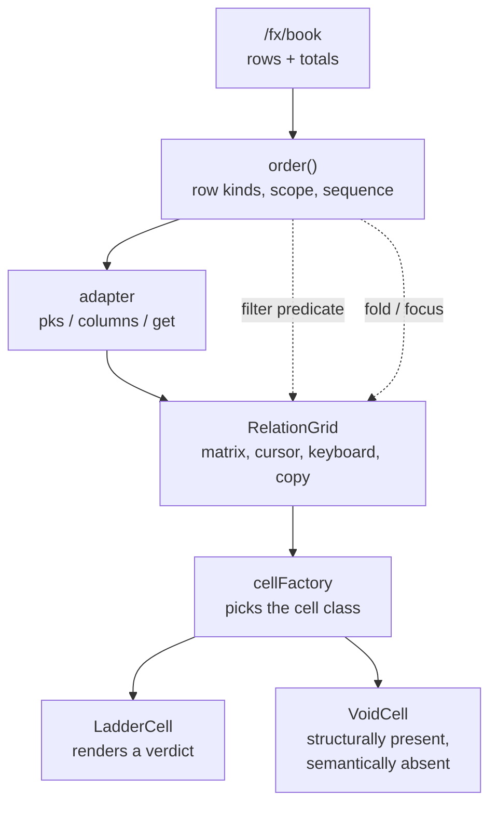

# Building a risk ladder on RelationGrid

**A case study.** The FX Options Desk needed a risk ladder: the book's exposure
down the tenor curve, grouped by pair, with subtotals and a book total, folding,
and states that tell a trader which numbers to trust. RFC 0050's `RelationGrid`
had just shipped in Homing 0.8.0 with no downstream consumer. This is what the
first one learned.

The short version: **almost nothing needed to be added to the grid**, and the
three times we concluded otherwise we were wrong. The interesting work was
deciding what a row *is*.

---

## 1. What was built



On screen:

```
Book ▸ tenor        Δ      vATM     vRR    vBF      Θ   freshness
▾ EURUSD
  1W            1.10M       18k     −2k     1k    −6k   ● 2s
  1M            3.40M       92k    −21k     6k    −9k   ● 2s
  3M            3.70M      102k    −15k     4k    −6k   ● 2s
  Subtotal      8.20M      212k    −38k    11k   −21k   ● 2s
▾ USDJPY
  1M          ◆ −800k     ◆ 61k    ◆ 9k   ◆ 4k  ◆ −5k   ▲ 45s
  6M         ◆ −1.30M     ◆ 87k   ◆ 13k   ◆ 5k  ◆ −6k   ▲ 45s
  Subtotal  ◆ −2.10M    ◆ 148k   ◆ 22k   ◆ 9k ◆ −11k   ▲ 45s
…
FXO book total  12.4M         —       —      —   −38k   —
```

Double-click a header, or press Enter on it, and the block folds to its subtotal.
Selecting a pair anywhere on the desk focuses the ladder to that pair.

## 2. The question that shaped everything: what is a row?

`RelationGrid` takes a flat list of primary keys. It has no grouping construct,
no row headers — `GridLayout.render` is handed a row **count** — and no notion
of a subtotal. The obvious reading is "the grid can't do grouped ladders".

That reading is wrong, and the correction is the heart of this study:

> **A row is a pk, and what a pk means is the domain's business.**

Once rows are domain objects, grouping is not a missing feature. It is a
consequence of four things the domain already controls:

| what | how |
|---|---|
| which rows exist | `pks()` |
| what order they read in | the order of `pks()` |
| which rows are visible | the predicate passed to `filterRows` |
| what each row looks like | the cell the factory returns |

The ladder models three kinds, each with a **scope**:

- `leaf` — one tenor of one pair, scope = that pair
- `subtotal` — one pair, all tenors, scope = that pair
- `grand` — the book, scope = `null`

and later a fourth, `section`, the row that opens a block. The kind rides on the
row record and is **never parsed back out of the pk string**. Asking an identity
what sort of thing it is would repeat the anti-pattern RFC 0053 had just retired
in this same codebase — a machine fact smuggled through a display channel.

## 3. Totals are domain facts, not grid arithmetic

A grid could sum a column. It must not.

Totals are frequently **not** sums of the visible rows. Some measures add across
tenors (vega, delta); some do not (VaR, gamma across strikes); some need netting
or FX conversion first. A grid can do the arithmetic but cannot know which
measures are additive — and the moment anyone filters, a grid-computed total
silently changes meaning from "the book's vega" to "the sum of what is on
screen".

So the server publishes them. `/fx/book` ships `totals` alongside `rows`, and the
ladder renders what it is given. Where the desk publishes no book-level
breakdown, the grand row shows **dashes**, and the ladder does not sum the rows
to fill them. A partial total that says so beats a complete-looking one the UI
invented.

## 4. A total as a row is dangerous — until the row has a kind

Modelling a total as an ordinary pk is attractive for rendering and hazardous for
operations, because every generic row operation then applies to it:

| operation | what it does to a total |
|---|---|
| `sortBy` | scatters Σ rows among the leaves, ordered by their large values |
| `filterRows` | tests the total by the same predicate — you can filter it away, or keep a total whose children are gone |
| `copySelection` | exports totals inline; the reader's autosum **double-counts** |
| `deleteSelectedRows` | a total is deletable |
| `update` | in an editable grid, a total is writable |

The double-count is the one that would actually bite, because pasting into a
sheet and summing a column is the natural next gesture.

The resolution is a **row kind with a scope**, and every invariant it implies is
enforceable in domain code, because every seam the grid exposes is already ours:

| invariant | where it lives |
|---|---|
| never filtered out by value | the predicate we pass to `filterRows` |
| sorts last **within its scope** | the order we hand to `pks()` |
| never copied as data | `getValueToCopy()` on our own cell |
| never written or deleted | the adapter's `update` / `deleteRows` |

Two refinements the implementation forced:

**"Sorts last" needs a scope.** Sorting aggregates last *overall* tears each
subtotal away from the rows it totals — worse than scattering, because it looks
deliberate. A pair's Σ closes its own block; the grand total closes the table.

**"Never filtered out" needs a scope too.** An aggregate is exempt from
predicates over its members' *values*, but is still subject to choosing a scope.
Focusing on USDJPY must drop the EURUSD subtotal — leaving it would show a total
for rows that are not there — while Σ USDJPY and Σ FXO book stay.

## 5. Six mechanics that shaped the design

None of these are defects. Each is a property of the grid that a consumer must
design around, and each is discoverable only by reading the source.

**A cell never learns its row.** The facade calls
`ensure(pk, col, factory, value)` with no `meta`, so a cell cannot ask "is this
tenor's reading stale against *its* budget?". The adapter answers instead and
ships the verdict inside the value — `{kind, text, n, state}`. The cell renders a
judgement already made. This is the right seam: the adapter faces the domain, the
cell is presentation.

**The factory is consulted once per cell.** `ensure` caches by `(pk, column)` and
returns early. So the cell *class* is permanent, and anything the factory
switches on must be a property of the row kind — which never changes for a given
row — rather than of whatever the value happened to be at first render.

**`filterRows` holds one predicate.** Two calls replace each other rather than
compose. Focus and folding are both view state, so they had to be written as a
single predicate; two independent calls would have meant focusing a pair quietly
unfolded everything.

**There is no row header.** `GridLayout.render({headers, rows})` takes a row
count. The tenor is therefore its own column, which turns out to be better: it
sorts, resizes and copies like any other.

**`.hgr-td` carries `padding: 0`** and the cell content is our own element. So a
band across a row is drawn by *its cells agreeing* — apply the treatment to every
cell of an aggregate row and it fills exactly, with no fight against the grid's
own styling. Weight on the label alone was not enough: with only the label
emboldened, a subtotal read as one more tenor once the eye was in the numbers.

**A cell with no text has no height.** The corollary of the above, and the one
that actually bit. The grid mints a bare `<div>` and styles none of it, so a
`VoidCell` — which by definition writes nothing — collapsed to zero and painted
its share of the band on nothing at all: the section header showed a strip under
its label and bare page across the other six columns. A band drawn by agreement
needs every cell to agree about its *height* as well as its colour, so the row
treatment fixes `line-height` and `min-height` to the same value. An empty cell
is then exactly as tall as a written one.

**`updateCell` batches on `requestAnimationFrame`.** A fold is a direct answer to
a gesture and should not wait on the compositor — and rAF does not run at all in
a hidden tab, which left the disclosure caret pointing the wrong way while the
fold itself applied. `flushNow()` makes it deterministic. The grid had already
learned this lesson on its own read paths: `copyTsv()` opens with a drain,
commented *"a read-path must never see stale cell state (the hidden-pane
lesson)"*.

## 6. Three times we thought the grid needed changing

This is the reflection worth keeping.

| we wanted | first conclusion | what was actually true |
|---|---|---|
| grouped rows with subtotals | "no row grouping — a real limitation" | pk design + ordering + filtering, all domain-side |
| a section header with empty cells | "void cells must be a grid concept — only the grid owns the matrix" | the **factory** picks the cell class; `VoidCell` is just another implementation of the contract |
| fold on double-click | "needs a grid gesture hook" | the grid binds `click` on its `<td>` and nothing else; a `dblclick` on our own element competes with nobody |

The failure mode each time was the same: reasoning from *"the grid owns the
matrix, therefore the grid must own statements about the matrix"*. But a cell
**is** the matrix at that position, and the cell is ours. The extension points —
`cellFactory`, the adapter, and the predicate — were sufficient every time.

The corollary for the next consumer: **before asking for a grid feature, ask
which of the three seams could express it.** The answer has so far always been at
least one of them.

## 7. What the grid genuinely owns

Not everything belongs downstream. The grid earns its place on:

- **the matrix** — slots, geometry, column widths, resize and reorder;
- **the cursor and selection**, delivered back as **identities** (`{pk, column}`,
  and row pks in view order) rather than positions, so domain code never maps
  coordinates to meaning;
- **keyboard traversal**;
- **the update batch** — coalescing a hot feed to one `cell.update()` per cell
  per frame, last write wins, degrading to a synchronous flush when there are no
  frames;
- **cell lifetime** — `ensure` is idempotent, filtered-out cells detach rather
  than die, and only a removed row disposes.

Note what the grid does *not* own: the clipboard. `copyTsv()` returns a string
and `onCopy(tsv)` hands it over, so a downstream can implement copy modes of
arbitrary domain complexity — "leaves only", "with lineage stamps", "as a mail
table" — from the selection identities, without the grid learning any of it.

## 8. Live data

Untried here, but the path is short and the batch was built for it:
`adapter.subscribe(fn)` gives the domain a push channel, and `fn` is the facade's
`updateCell` — straight to the cell, no positional lookup. Three obligations fall
on the feed rather than the grid:

1. **Aggregates must tick too.** Having decided the UI must not compute totals,
   a feed that ticks only leaves leaves every Σ stale. The server has to publish
   subtotals and the grand total on the same channel.
2. **The adapter's model must stay in step**, since `ensure` re-reads
   `adapter.get` only when minting a new cell.
3. **Row-set changes are `addRow`/`removeRow`**, not cell updates.

## 9. Honest gaps

- The ladder **follows** the selection bus but never drives it. Every other
  trader widget publishes; clicking a tenor here moves a cursor and nothing else.
- **Copy is not wired.** `onCopy` is only bound when supplied, so `Ctrl+C` in the
  ladder currently does nothing — the copy-safety guard on the cells is correct
  but, as yet, unreachable.
- **Fold and focus do not survive a reconstruction.** The widget takes no params,
  so the state lives in a closure; a replay reopens every block.
- **Freshness thresholds are UI-invented** in two widgets that must be kept in
  step by hand. That verdict belongs upstream, next to the reval budget the
  server already publishes.
- **Sorting is deliberately not exposed.** `sortBy` would scatter the aggregates;
  a within-scope sort has to be computed by the domain and handed over through
  the row view.
